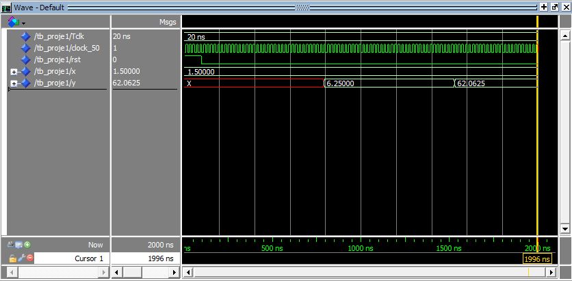

# FPGA Tabanlı Geri Beslemeli Sayısal Aritmetik Birimi

Bu proje, FPGA üzerinde geri beslemeli bir sayısal aritmetik birimi tasarımını içermektedir.  
Tasarlanan devre, aşağıdaki ikinci dereceden fonksiyonu hesaplamak üzere oluşturulmuştur:

**f(x) = y = x² + 4x – 2**

Tasarımda `fp_add` ve `fp_mult` gibi kayan nokta aritmetik bileşenleri (IEEE-754 32-bit) kullanılmıştır.

## Projenin Amacı
Bu projenin amacı, FPGA üzerinde geri beslemeli bir hesaplama yapısı kullanarak
ikinci dereceden polinom fonksiyonlarının hesaplanmasını sağlamaktır.  
Tasarımda kayan nokta çarpanlar ve toplayıcılar kullanılarak fonksiyonun çıktısı
adım adım hesaplanmaktadır.

- **Girdi:** `x` (IEEE-754 32-bit floating-point)  
- **Çıktı:** `y` (IEEE-754 32-bit floating-point)  
- **Fonksiyon:** f(x) = x² + 4x – 2  

## Yapı
- `rtl/fp_add.vhd`: Kayan nokta toplama bileşeni  
- `rtl/fp_mult.vhd`: Kayan nokta çarpma bileşeni  
- `rtl/proje1.vhd`: Üst seviye tasarım (geri beslemeli aritmetik birim)  
- `tb/tb_proje1.vhd`: Testbench dosyası  
- `waves/waves.vcd`: Simülasyon VCD çıktısı  
- `waves/feedback_sim.png`: Simülasyon dalga formu görüntüsü  
- `docs/x^2+4x-2.png`: Tasarımın blok diyagramı  

## Simülasyon
Simülasyon sonucunda fonksiyonun verilen giriş değerleri için doğru çıktılar ürettiği gözlemlenmiştir.



## Çalıştırma
ModelSim/Questa üzerinde simülasyonu çalıştırmak için:  
```tcl
vsim -do scripts/run_vcd.do
```

Bu komut ile `waves/waves.vcd` dosyası yeniden oluşturulur.  
Var olan sonuçları incelemek için `waves/feedback_sim.png` ve `waves/waves.vcd` dosyaları kullanılabilir.
