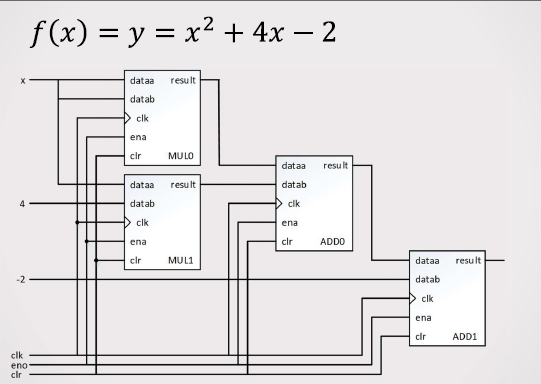

# FPGA-Based Feedback Digital Arithmetic Unit

This project implements a feedback digital arithmetic unit on FPGA.  
The designed circuit evaluates the following quadratic function:

**f(x) = y = x² + 4x – 2**

Floating-point arithmetic components (`fp_add`, `fp_mult`) based on IEEE-754 32-bit are used in the design.

## Simulation
The simulation shows that the circuit produces the correct outputs for the given input values.


## Project Purpose
The purpose of this project is to design a feedback-based computation unit on FPGA
to evaluate quadratic polynomial functions.  
Floating-point multipliers and adders are used to compute the function output step by step.

- **Input:** `x` (IEEE-754 32-bit floating-point)  
- **Output:** `y` (IEEE-754 32-bit floating-point)  
- **Function:** f(x) = x² + 4x – 2  

## Structure
```
FPGA-Based-Feedback-Digital-Arithmetic-Unit/
├── rtl/
│ ├── fp_add.vhd -- Floating-point adder component
│ ├── fp_mult.vhd -- Floating-point multiplier component
│ └── proje1.vhd -- Top-level arithmetic unit
│
├── tb/
│ └── tb_proje1.vhd -- Testbench
│
├── waves/
│ ├── waves.vcd -- Simulation VCD output
│ └── feedback_sim.png -- Simulation waveform screenshot
│
├── docs/
│ └── x^^2+4x-2.png -- Block diagram of the design
│
├── README.md
└── .gitignore
```

## Run
To run the simulation in ModelSim/Questa:  
```tcl
vsim -do scripts/run_vcd.do
```
This command regenerates the waves/waves.vcd file.
To review the existing results, check waves/feedback_sim.png and waves/waves.vcd.
---------------------------------------------------------------------------------------------------
## Block Diagram

The following diagram illustrates the quadratic function f(x) = x² + 4x – 2:


---------------------------------------------------------------------------------------------------

# FPGA Tabanlı Geri Beslemeli Sayısal Aritmetik Birimi

Bu proje, FPGA üzerinde geri beslemeli bir sayısal aritmetik birimi tasarımını içermektedir.  
Tasarlanan devre, aşağıdaki ikinci dereceden fonksiyonu hesaplamak üzere oluşturulmuştur:

**f(x) = y = x² + 4x – 2**

Tasarımda `fp_add` ve `fp_mult` gibi kayan nokta aritmetik bileşenleri (IEEE-754 32-bit) kullanılmıştır.

## Projenin Amacı
Bu projenin amacı, FPGA üzerinde geri beslemeli bir hesaplama yapısı kullanarak
ikinci dereceden polinom fonksiyonlarının hesaplanmasını sağlamaktır.  
Tasarımda kayan nokta çarpanlar ve toplayıcılar kullanılarak fonksiyonun çıktısı
adım adım hesaplanmaktadır.

- **Girdi:** `x` (IEEE-754 32-bit floating-point)  
- **Çıktı:** `y` (IEEE-754 32-bit floating-point)  
- **Fonksiyon:** f(x) = x² + 4x – 2  

## Yapı
```
FPGA-Based-Feedback-Digital-Arithmetic-Unit/
├── rtl/
│ ├── fp_add.vhd -- Kayan nokta (floating-point) toplama birimi
│ ├── fp_mult.vhd -- Kayan nokta (floating-point) çarpma birimi
│ └── proje1.vhd -- Üst seviye dijital aritmetik birimi
│
├── tb/
│ └── tb_proje1.vhd -- Tasarım için testbench
│
├── waves/
│ ├── waves.vcd -- Simülasyon çıktısı (VCD)
│ └── feedback_sim.png -- Geri beslemeli yapı için dalga formu
│
├── docs/
│ └── x^2+4x-2.png -- Tasarımın blok diyagramı
│
├── README.md
└── .gitignore
```

## Çalıştırma
ModelSim/Questa üzerinde simülasyonu çalıştırmak için:  
```tcl
vsim -do scripts/run_vcd.do
```

Bu komut ile `waves/waves.vcd` dosyası yeniden oluşturulur.  
Var olan sonuçları incelemek için `waves/feedback_sim.png` ve `waves/waves.vcd` dosyaları kullanılabilir.

## Author - Yazar

Hasan Burak Çiftçi  
Electrical & Electronics Engineer  
